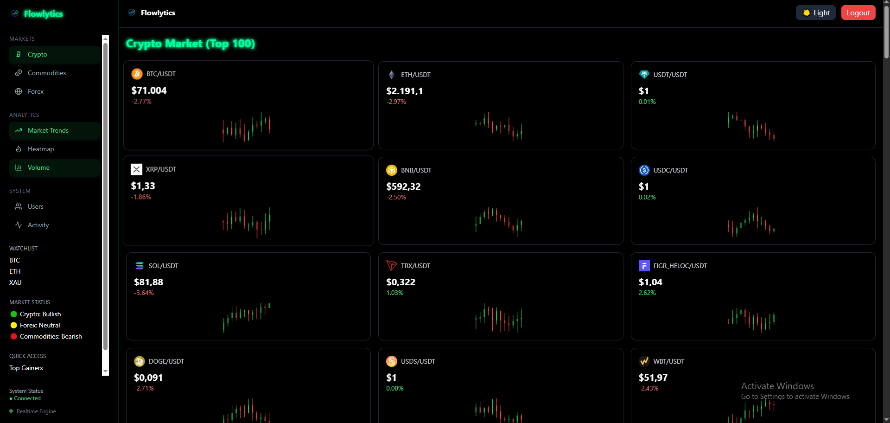

# 🚀 Flowlytics Crypto Dashboard

A modern SaaS-style crypto analytics dashboard built with:

- React + TypeScript
- Tailwind CSS
- Recharts
- Supabase (Auth)
- CoinGecko API (Real Data)

## ✨ Features

- 🔐 Magic link authentication
- 📊 Real-time crypto price tracking
- 🔄 Auto-refresh data (10s)
- 🪙 Multi-coin support (BTC, ETH, SOL, MATIC)
- 💱 IDR → Crypto converter
- 📈 30-day price chart

## 🌐 Live Demo

https://flowlytics-red.vercel.app/crypto

## 📦 Tech Stack
- Frontend: React, Vite, Tailwind
- Backend: Supabase
- API: CoinGecko

## 📸 Preview

---

Built for portfolio & frontend engineering showcase.
